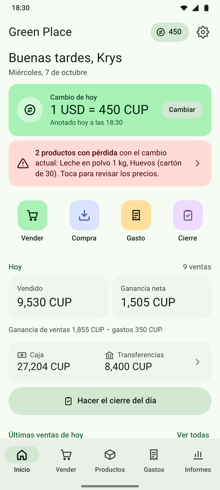
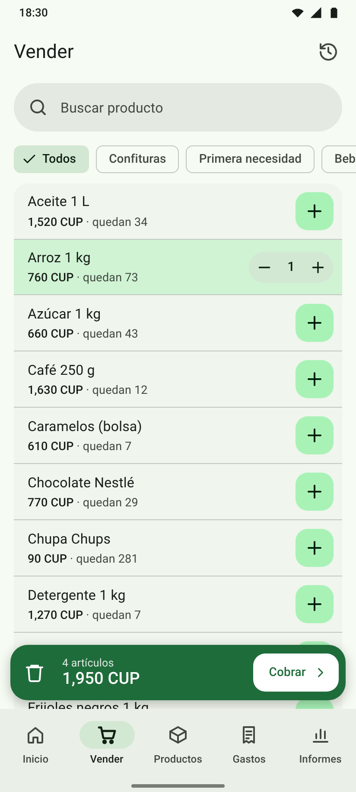
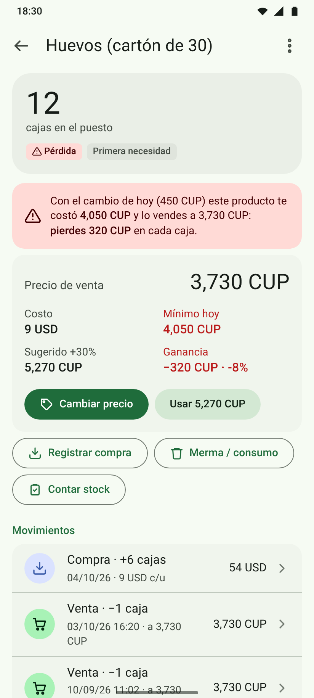
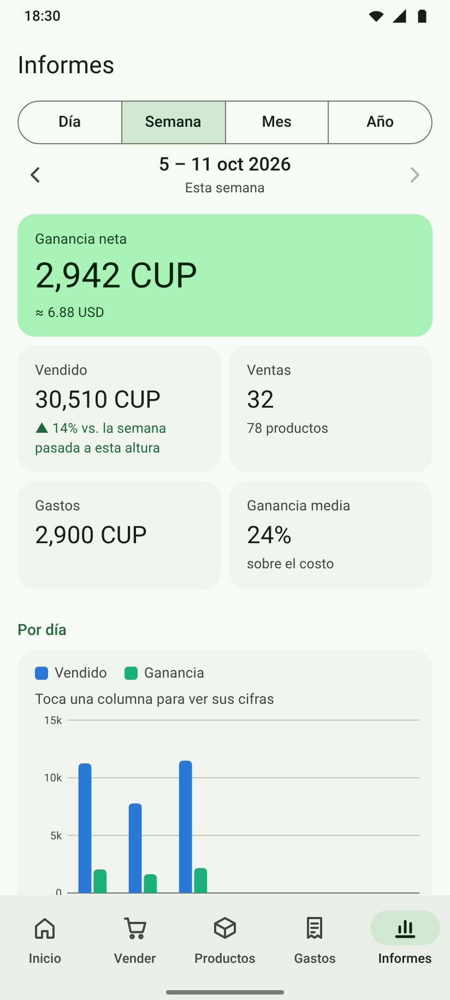
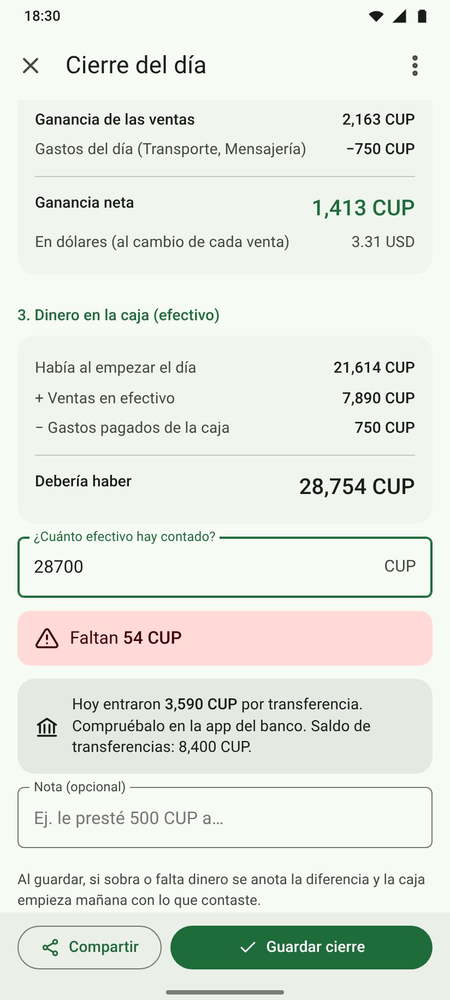

# Green Place

Web app para Android del puesto **Green Place**: inventario, precios en CUP calculados con el cambio del dólar del día, ventas, compras, gastos, estadísticas y el **cierre del día** para comprobar el dinero de la caja.

- 📱 Diseño Material (Android), modo claro y oscuro, botón «Atrás» del teléfono.
- ✈️ Se instala desde Chrome y funciona **sin internet**.
- 🔒 Los datos se guardan **solo en el teléfono**, no en GitHub. Hay copia de seguridad para exportar y restaurar.

**App:** https://marcoh03.github.io/Webapp_green_place/
**Manual de uso:** [manual/Manual-Green-Place.pdf](manual/Manual-Green-Place.pdf)
**Capturas:** carpeta [`preview/`](preview/)

| Inicio | Vender | Producto con pérdida | Informes | Cierre |
|---|---|---|---|---|
|  |  |  |  |  |

## Funciones

- **Cambio del dólar**: lo pregunta la primera vez que se abre la app cada día y se puede cambiar en cualquier momento. Guarda el historial.
- **Precios**: el precio sugerido es el costo en USD × el cambio + 30% (configurable, con redondeo). Cada producto muestra el **precio mínimo** para no perder con el cambio de ese momento. El costo es el promedio ponderado de las compras.
- **Avisos de pérdida**: al subir el dólar avisa de los productos que se venden por debajo del costo y permite poner el precio sugerido a todos de una vez.
- **Las ventas guardan su precio, su costo y el cambio del momento**: cambiar un precio después no altera el dinero ni las ganancias de ventas anteriores.
- **Vender**: carrito, precio especial por venta, vuelto, efectivo / transferencia / mixto, deshacer, anular y recuperar.
- **Compras** en USD o CUP con precio de venta sugerido por producto y origen del dinero (caja, transferencias o dinero aparte).
- **Inventario**: stock, poco stock, agotados, mermas, consumo propio y conteo; valor del inventario al costo y a precio de venta.
- **Gastos** del negocio por categoría (mensajería, transporte, impuestos, imprevistos…) en CUP o USD.
- **Dinero**: caja (efectivo) y transferencias, con ingresos, retiros y arqueos.
- **Informes** por día, semana, mes o año: vendido, ganancia, gastos, mermas, ganancia neta (también en USD), gráfico, productos más vendidos, gastos por tipo y cierres.
- **Cierre del día**: ventas, ganancia neta, efectivo esperado contra efectivo contado (sobrante o faltante) y resumen para compartir por WhatsApp.

## Publicar con GitHub Pages (una sola vez)

1. Fusiona esta rama en `main`.
2. En GitHub: **Settings → Pages → Build and deployment → Source: Deploy from a branch**, rama `main`, carpeta `/ (root)` → **Save**.
3. En un par de minutos la app estará en `https://marcoh03.github.io/Webapp_green_place/`.

El archivo `.nojekyll` hace que GitHub sirva los archivos tal cual. El repositorio solo contiene el código y datos de ejemplo inventados (en las capturas).

## Instalar en el teléfono Android

1. Abre la dirección de la app en **Google Chrome**.
2. Toca **Instalar aplicación** (o menú ⋮ → **Instalar aplicación** / **Añadir a pantalla de inicio**).
3. Ábrela siempre desde el icono de Green Place. A partir de ahí funciona sin conexión.

## Estructura

```
index.html              Página principal (PWA)
manifest.webmanifest    Datos para instalarla en Android (icono, colores, capturas)
sw.js                   Service worker: guarda la app para usarla sin internet
css/app.css             Estilos Material Design 3
fonts/                  Roboto
js/store.js             Datos (IndexedDB) y todos los cálculos: precios, stock, costo promedio, dinero, estadísticas, cierre
js/ui.js                Componentes: pantallas, diálogos, hojas inferiores, snackbar y botón Atrás
js/app.js               Pestañas (Inicio, Vender, Productos, Gastos, Informes) y arranque
js/products.js          Productos, precios, cambio del dólar, compras, mermas y conteo
js/sales.js             Carrito, cobro, historial, detalle de venta y cierre del día
js/money.js             Gastos, caja y transferencias
js/settings.js          Ajustes, bienvenida, copias de seguridad e instalación
js/closure.js           Texto del cierre para compartir
icons/                  Iconos de la app
manual/                 Manual de uso en PDF
preview/                Capturas con datos de ejemplo
tools/                  Scripts para regenerar iconos, capturas y manual
```

## Desarrollo

No hace falta compilar nada. Para probar en local:

```bash
npx http-server -p 8080 -c-1 .
```

Al publicar cambios, **sube la versión** de `VERSION` en `sw.js` (y `APP_VERSION` en `js/store.js`) para que los teléfonos descarguen la versión nueva; la app mostrará el aviso «Hay una nueva versión».

Regenerar iconos, capturas y manual (con el servidor local en marcha):

```bash
NODE_PATH=$(npm root -g) node tools/make-icons.cjs
NODE_PATH=$(npm root -g) node tools/screenshots.cjs
DARK=1 NODE_PATH=$(npm root -g) node tools/screenshots.cjs
NODE_PATH=$(npm root -g) node tools/make-manual.cjs
```
